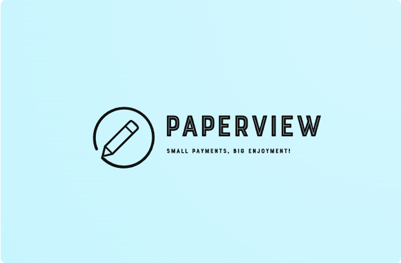

# PaperView

PaperView is a Stellar Soroban smart contract designed to facilitate micropayments for a Medium-like blog platform. This platform allows content creators to post blogs where readers can view an introductory section for free. If readers are interested in the full content, they can make a small micropayment to unlock the entire blog. This approach provides a seamless way for creators to monetize their content and for readers to access high-quality articles with minimal financial commitment.

## MicroPayments Concept

Micropayments are small financial transactions, often involving amounts less than a dollar. They are particularly suitable for digital content transactions where the cost of the content is low and the volume of transactions can be high. Micropayments enable:

- **Affordable Access**: Users pay small amounts to access content, which can add up to significant revenue for creators.
- **Increased Monetization**: Creators can monetize content that might not justify a higher price tag, increasing overall earnings.
- **Low Transaction Costs**: The technology behind micropayments minimizes transaction fees, making it economical to handle small payments.

Micropayments are becoming increasingly important in the digital economy, enabling new business models for content delivery, from articles and music to videos and other media.

## Project Features

- **Blog Management**: Creators can post blogs with a unique, auto-incrementing blog ID.
- **Micropayment System**: Readers can make micropayments to access the full content of a blog.
- **Creator Retrieval**: Fetch the address of the creator of a blog using the blog ID.
- **Payment Status Check**: Verify if a reader has paid for a particular blog.
- **Payment Update**: Update the status once a reader makes a payment.

## Future Scope

The project has the potential to evolve into a platform for short-form video content, akin to TikTok. In this expanded version, creators could upload short videos, and viewers would be shown a preview (the first 5-10 seconds). If viewers wish to watch the entire video, they would make a micropayment, thus unlocking the full content. This model leverages the same principles of micropayments to provide a scalable solution for monetizing short-form video content.

## Getting Started

To get started with the MicroPaymentManager, follow the steps below:

1. **Clone the repository**:
    ```bash
    git clone https://github.com/yourusername/micropayment-manager.git
    cd micropayment-manager
    ```

2. **Build the project**:
    ```bash
    cargo build --target wasm32-unknown-unknown --release
    ```

3. **Deploy the contract**: Deploy the compiled WebAssembly (WASM) binary to the Stellar network.

4. **Interact with the contract**: Use Stellar SDKs or CLI tools to interact with the contract methods.

## Contract Methods

### addBlog

```rust
pub fn addBlog(env: &Env, creator: Address)
```

Allows a creator to post a new blog. The blog ID is auto-incremented.

### makeMicroPayment

```rust
pub fn makeMicroPayment(env: &Env, reader: Address, _blogId: u32)
```

Handles the micropayment from a reader to the creator of the blog.

### updatePaymentStatus

```rust
pub fn updatePaymentStatus(env: &Env, addr: Address, index: u32)
```

Updates the payment status for a reader after they make a payment.

### getCreator

```rust
pub fn getCreator(env: &Env, _blogId: u32) -> Address
```

Fetches the address of the creator of a given blog ID.

### getPaymentStatus

```rust
pub fn getPaymentStatus(env: &Env, index: u32, addr: Address) -> bool
```

Checks if a reader has made a payment for a particular blog.

## Example Code Explanation

Here is a brief explanation of the provided Rust code:

### Constants

- `wage`: The static micropayment amount set to 10.

### Enums

- `StorageKey`: Enum used for storing the blog ID.
- `DataKey`: Enum used for mapping blog IDs to creators and payment statuses.

### Structs

- `MicroPaymentManager`: The main contract struct.

### Implementations

#### addBlog

Allows creators to post new blogs. It increments the blog ID and stores the mapping between blog ID and creator.

#### makeMicroPayment

Facilitates the micropayment from the reader to the creator. It authenticates the reader, retrieves the creator's address, and processes the payment.

#### updatePaymentStatus

Updates the storage to reflect that a reader has paid for a particular blog.

#### getCreator

Retrieves the creator's address for a given blog ID.

#### getPaymentStatus

Checks if a reader has paid for a particular blog.

## Issues

The current implementation has an issue with the `token::Client::new(&env, &reader).transfer(&reader, _creator, &_wage);` line which needs addressing to ensure correct token transfer.

## License

This project is licensed under the MIT License - see the LICENSE.md file for details.

---

Feel free to contribute to the project by opening issues and submitting pull requests!